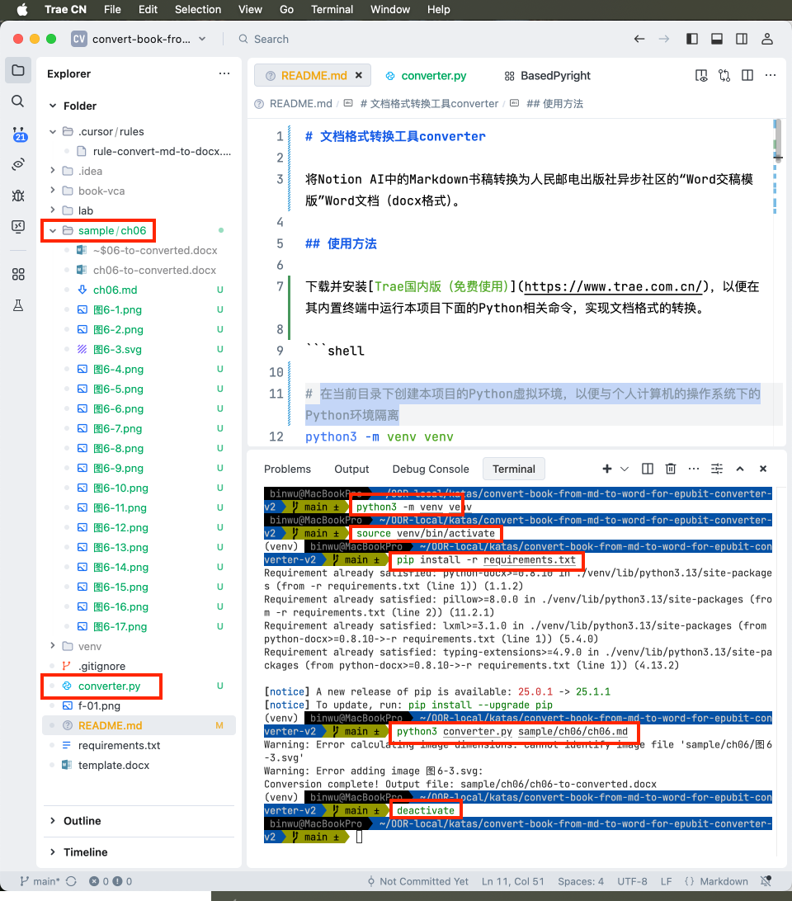

# Markdown to Word Converter

## 使用方法

```shell
# Create a virtual environment in the current directory
python3 -m venv venv

# Activate the virtual environment
source venv/bin/activate

# Install the packages in the virtual environment
pip install -r requirements.txt

# Now you can run your script
python3 converter-v2.py lab/template-from.md

# 这将：
# 1. 读取指定的Markdown文件lab/template-from.md
# 2. 将模板文件`template.docx`复制为`template-to-converted.docx`
# 3. 将Markdown内容转换为具有适当样式的Word文档
# 4. 将结果保存为`template-to-converted.docx`，之后可以用Word打开查看效果


# Deactivate the virtual environment when done
deactivate
```



## 样式映射

转换器将Markdown元素映射到以下Word样式：

| Markdown元素 | Word样式 |
|-------------|---------|
| `#` | Heading 1 |
| `##` | Heading 2 |
| `###` | Heading 3 |
| `#### 1. 文本` | Heading 4 |
| 普通段落 | Normal |
| `- ` | 第1级无序列表 |
| 代码块 ``` | 代码无行号 |
| 以"代码清单"开头的行 | 超强提示标签 |
| 以"表"开头的行 | 表题 |
| 以`|`开头的表格内容 | 表格单元格 |
| 包含"【避坑指南】"的行 | 强提示标签 |
| `<aside>`标签内的内容 | 强提示 |
| 图片标题 | 图题 |

## 注意事项

- Markdown文件中的图片应该在同一目录或子目录中
- template.docx文件必须包含所有需要的样式
- 转换后的文档可能需要少量手动格式调整

## 历史开发记录

converter-v2的开发提示词：（见.cursor/rules/rule-convert-md-to-docx.mdc）

最初的开发提示：

```markdown
我上传了3个文件，其中 ch04-from.md 和 ch04-to-original.docx 是两个格式不同但内容相同的文件。我需要一个名为 converter 的 Python 程序来分析这两个文件的格式差异。当运行 "python3 converter ch04-from.md" 时，程序应执行以下操作：读取 ch04-from.md 的内容，复制 ch04-to-template.docx 文件并重命名为 ch04-to.docx，然后将 ch04-from.md 中的内容按照 ch04-to-original.docx 的格式写入 ch04-to.docx 中。转换完成后，用 Word 打开 ch04-to.docx 时应与 ch04-to-original.docx 的效果完全一致。由于没有上传 markdown 文件中的图片，转换后的 ch04-to.docx 可以不包含图片，但所有文字内容和格式必须与原文件保持一致，不能增减。如遇到"【避坑指南】"这样的特殊格式无法确定如何转换，请告知并尽力保留这些内容。
```

新的版本converter-v2.py增加了对图片的支持，并修复了许多格式问题。用于将特定格式的Markdown文件转换为带有特定样式的Word文档。


## 从Notion将Markdown格式文本复制到Markdown文件后微调格式

- （无）

## 运行完python格式转换程序后微调格式

- 转换后svg图缺失，需要手工插入

