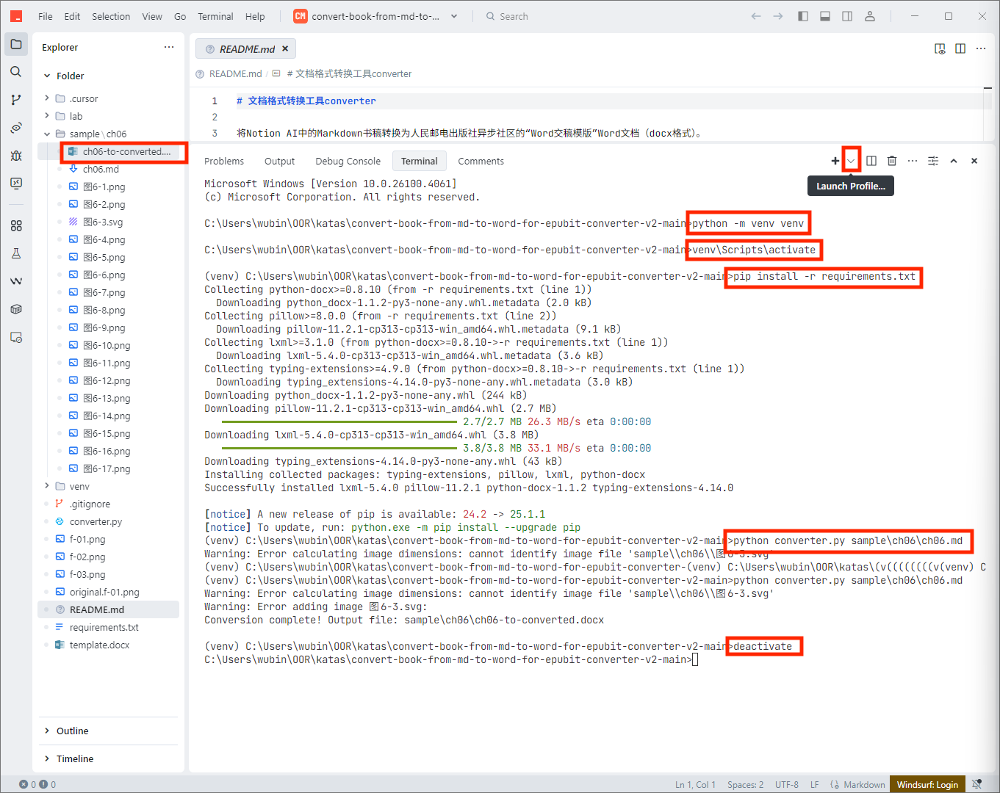

# 文档格式转换工具converter

将Notion AI中的Markdown书稿转换为人民邮电出版社异步社区的“Word交稿模版”Word文档（docx格式）。

## 使用方法（适用Windows 11电脑）

1. 安装IDE：下载并安装[Trae国内版（免费使用）](https://www.trae.com.cn/)，以便在其内置终端中运行后面的Python相关命令，实现文档格式的转换。

2. 下载本项目：点击本页面右上方"克隆/下载"按钮，再点击"下载ZIP"，把本项目下载到本地计算机，并解压。

3. 打开本项目：打开Trae国内版，在菜单中选择File -> Open Folder，选择本项目解压后的目录，打开本项目。

4. 打开内置终端运行样例文件转换命令：在Trae的菜单中选择View -> Terminal，打开Trae内置的终端。然后点击Terminal右上方的“+”右侧的向下小箭头（“Launch Profile”按钮），选“Command Prompt，内置终端会出现cmd命令提示。然后执行下面的命令，实现sample目录下的样例文档格式的转换。

```cmd
# 在当前目录下创建本项目的Python虚拟环境，以便与个人计算机的操作系统下的Python环境隔离
python -m venv venv

# 激活虚拟环境
venv\Scripts\activate

# 在虚拟环境中安装本项目代码运行时需要的依赖包
pip install -r requirements.txt

# 运行本项目代码
# 这将：
# 1. 读取待转换的Markdown文件sample\ch06\ch06.md
# 2. 将模板文件`template.docx`复制为`template-to-converted.docx`
# 3. 将Markdown内容转换为具有适当样式的Word文档
# 4. 将结果保存为`sample\ch06\ch06-to-converted.docx`，之后可以用Word打开查看效果
python converter.py sample\ch06\ch06.md

# 转换完后退出虚拟环境
deactivate
```



5. 转换自己的单章Markdown书稿：sample目录下的ch06.md只是个本项目为方便用户使用时参考的转换样例。如果你想转换自己的Markdown文档，可以在本项目根目录下创建自己的书的目录（比如"book"），然后在其中创建章节目录（比如"ch01"），并把该章的一个Markdown文档和插图复制到这个目录下。之后可以仿照上面的命令，将sample\ch06\ch06.md替换为自己的Markdown文档路径（比如book\ch01\ch01.md），进行转换。

6. 转换自己的多章Markdown书稿：如果你想转换多章的书稿，那么请把这些章节的内容都保存在一个Markdown文件中，并把其中的插图也保存在相同的目录下，然后使用这个Markdown文件的路径替换上面的命令中的Markdown文档路径。

### 主要改动说明

- `python3` 改为 `python`（Windows下通常使用python命令）
- `source venv/bin/activate` 改为 `venv\Scripts\activate`（Windows下虚拟环境激活方式）
- 路径分隔符保持使用正斜杠 `/`，因为Python和大多数命令行工具都能正确处理

## 使用方法（适用mac电脑）

1. 安装IDE：下载并安装[Trae国内版（免费使用）](https://www.trae.com.cn/)，以便在其内置终端中运行后面的Python相关命令，实现文档格式的转换。

2. 下载本项目：点击本页面右上方“克隆/下载”按钮，再点击“下载ZIP“，把本项目下载到本地计算机，并解压。

3. 打开本项目：打开Trae国内版，在菜单中选择File -> Open Folder，选择本项目解压后的目录，打开本项目。

4. 打开内置终端运行样例文件转换命令：在Trae的菜单中选择View -> Terminal，打开Trae内置的终端。然后执行下面的命令，实现sample目录下的样例文档格式的转换。

```shell

# 在当前目录下创建本项目的Python虚拟环境，以便与个人计算机的操作系统下的Python环境隔离
python3 -m venv venv

# 激活虚拟环境
source venv/bin/activate

# 在虚拟环境中安装本项目代码运行时需要的依赖包
pip install -r requirements.txt

# 运行本项目代码
# 这将：
# 1. 读取待转换的Markdown文件sample/ch06/ch06.md
# 2. 将模板文件`template.docx`复制为`template-to-converted.docx`
# 3. 将Markdown内容转换为具有适当样式的Word文档
# 4. 将结果保存为`sample/ch06/ch06-to-converted.docx`，之后可以用Word打开查看效果
python3 converter.py sample/ch06/ch06.md

# 转换完后退出虚拟环境
deactivate
```


5. 转换自己的Markdown书稿：sample目录下的ch06.md只是个本项目为方便用户使用时参考的转换样例。如果你想转换自己的Markdown文档，可以在本项目根目录下创建自己的书的目录（比如“book“），然后在其中创建章节目录（比如“ch01“），并把该章的一个Markdown文档和插图复制到这个目录下。之后可以仿照上面的命令，将sample/ch06/ch06.md替换为自己的Markdown文档路径（比如book/ch01/ch01.md），进行转换。

6. 转换自己的多章Markdown书稿：如果你想转换多章的书稿，那么请把这些章节的内容都保存在一个Markdown文件中，并把其中的插图也保存在相同的目录下，然后使用这个Markdown文件的路径替换上面的命令中的Markdown文档路径。


## 注意事项

- 本项目只支持单个Markdown文件转换，不支持多个Markdown文件批量转换
- Markdown文件中的图片应该存放在与该文件相同的目录中
- 若待转换的Markdown文件中包含Markdown格式的代码片段，且该代码片段内又嵌套了Markdown格式的代码片段，那么转换后的Word文档对于嵌套的代码片段转换格式不正确。解决方法是将嵌套的Markdown格式的代码片段转换为XML格式的代码片段，见下面的示例。

将有嵌套的Markdown代码段：


改为：


- 本项目根目录下的template.docx文件（即`模版-Word交稿模板-16开-小标题字号.docx`）必须包含所有需要的样式
- 转换后的文档可能需要少量手动格式调整
  - 转换后svg图在docx文件中缺失，需要手工插入


## 样式映射

转换器将Markdown元素映射到以下Word样式：

| Markdown元素 | Word样式 |
|-------------|---------|
| `#` | Heading 1 |
| `##` | Heading 2 |
| `###` | Heading 3 |
| `#### 1. 文本` | Heading 4 |
| 普通段落 | Normal |
| `- ` | 第1级无序列表 |
| 代码块 ``` | 代码无行号 |
| 以"代码清单"开头的行 | 超强提示标签 |
| 以"表"开头的行 | 表题 |
| 以`|`开头的表格内容 | 表格单元格 |
| 包含"【避坑指南】"的行 | 强提示标签 |
| `<aside>`标签内的内容 | 强提示 |
| 图片标题 | 图题 |

## 历史开发记录

converter的开发提示词：（见[.cursor/rules/rule-convert-md-to-docx.mdc](.cursor/rules/rule-convert-md-to-docx.mdc)）

最初的开发提示（只能完成80%的格式转换，故废弃）：

```markdown
我上传了3个文件，其中 ch04-from.md 和 ch04-to-original.docx 是两个格式不同但内容相同的文件。我需要一个名为 converter 的 Python 程序来分析这两个文件的格式差异。当运行 "python3 converter ch04-from.md" 时，程序应执行以下操作：读取 ch04-from.md 的内容，复制 ch04-to-template.docx 文件并重命名为 ch04-to.docx，然后将 ch04-from.md 中的内容按照 ch04-to-original.docx 的格式写入 ch04-to.docx 中。转换完成后，用 Word 打开 ch04-to.docx 时应与 ch04-to-original.docx 的效果完全一致。由于没有上传 markdown 文件中的图片，转换后的 ch04-to.docx 可以不包含图片，但所有文字内容和格式必须与原文件保持一致，不能增减。如遇到"【避坑指南】"这样的特殊格式无法确定如何转换，请告知并尽力保留这些内容。
```
