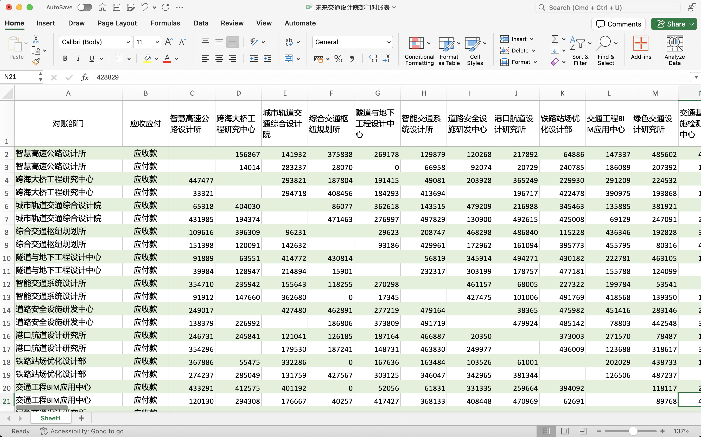
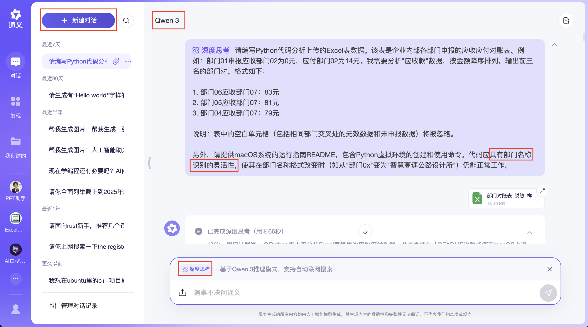

# 第4章 用通义分析Excel数据

许多人在工作中都难以从大型Excel数据表中提炼关键数据。举个例子，当领导要求你从一个包含40多个部门互相有应收和应付款项记录的Excel表中，列出应收款项最大的前3个部门时，你可能会感到为难，因为找公司IT部门帮忙需要漫长等待。但现在有了Vibe编程靠自己就能轻松解决这个问题。通过阅读本章，你将学会如何使用中文自然语言，让通义为你生成一段Python代码，在半小时内完成这项任务。

## 4.1 需求分析

这个找出应收款金额最大的3个部门的例子来自我的亲身经历。为了便于编入书中，我对需求进行了简化和脱敏处理，但依然保留了真实场景的核心特点。

假设你在未来交通设计院工作。一天，领导交给你一项任务：汇总该院41个部门之间的应收应付款项。这些款项源于部门间的人员借调（例如，当部门1借调部门2的设计师来完成项目时，这位设计师在借调期间的工时费就成为部门2应收部门1的款项，同时也是部门1应付部门2的款项），你需要从中找出应收金额最大的前3个部门。

这个看似简单的需求实际上涉及大量数据处理。将所有信息整理成Excel表（参见本书配套代码ch04-tongyi/未来交通设计院部门对账表.xlsx）后，会形成一个41列（对应各部门）、82行（对应每个部门的应收和应付款）的表格，总计约3000多个数据点。即使只关注应收款项，也需要从约1500个数据中筛选出前3名。如图4-1所示。



图4-1 未来交通设计院41个部门的对账表

由于公司的敏感信息不能外泄，如果要使用DeepSeek官方聊天机器人等外网AI应用，需要先对数据进行脱敏处理。

现在需求已经明确，下一步就是选择合适的Vibe编程工具。

## 4.2 选择Vibe编程工具的策略

对于第4.1节所描述的需求，AI聊天机器人、AI原生IDE以及传统IDE中的AI插件都能实现，那该如何选择。如果你首次处理这类需求，可以参考下面的Vibe编程指导原则。

<aside>
💡

Vibe编程第一指导原则：Vibe编程适用于解决简单需求，而不适合处理复杂需求。

Vibe编程第二指导原则：当你完全理解任务的意义、概念和实现方法，并能在提示词中清晰表达这些要素时，即使使用能力较弱但口碑良好的大模型，也能获得与顶尖大模型相当的效果。

第二指导原则推论1：如果预算有限，只能使用能力较弱但口碑良好的大模型，你就需要更深入地理解任务的意义、概念和实现方法，并在提示词中更准确地表达相关要素，以获得高质量的回复。

第二指导原则推论2：当你对任务的意义、概念和实现方法理解不够深入，无法在提示词中清晰表达时，你需要选择能力和口碑更强的大模型。

Vibe编程第三指导原则：使用特定AI大模型时，优先选择该模型开发商自己提供的成熟且口碑良好的Vibe编程工具。

</aside>

让我们通过具体实例来更好地理解这些指导原则。

第一指导原则的含义是：当项目的代码规模在几百行以内时，Vibe编程最为适用（第二和第三指导原则都建立在这个基础之上）。

第二指导原则表明：如果你既是编程专家又是业务专家，使用通义AI聊天机器人（搭配qwen3大模型）可以生成与Cursor（搭配Claude-4-sonnet）同等质量的代码。

推论1指出：如果预算限制只能使用免费的通义AI聊天机器人（搭配qwen3大模型），要获得高质量回复，你需要更透彻地理解任务的意义、概念和实现方法，并在提示词中准确表达这些要素。

推论2说明：当你对任务的意义、概念和实现方法理解不够深入，难以在提示词中清晰表达时，应选择能力和口碑更强的大模型，如Claude聊天机器人（搭配Sonnet-4大模型）或Cursor（搭配Claude-4-sonnet大模型）。

第三指导原则建议：使用DeepSeek-r1大模型时，优先选择DeepSeek官方的网页端或手机应用；使用qwen3大模型时，优先选择通义官方网页端（值得注意的是，通义开发商阿里于2025年5月29日推出的Lingma IDE尚未完全成熟，例如在提示词输入框中无法通过"#"或"+"按钮插入以中文命名的Excel文件）；使用Claude-4-sonnet大模型时，优先选择Claude聊天机器人（即官方网页端、手机应用或桌面应用）。

回到第4.1节所描述的需求，这个数据分析实战项目恰好适合使用Python来解决。作为一名Python新手，我遵循推论2，选择了Claude聊天机器人。

## 4.3 用Claude分析Excel数据

确定使用Claude后，我需要解决数据脱敏的问题。我将图4-1中表格内的所有数据（包括部门名称）替换为脱敏后的假数据，且只需7个部门即可。这样做有两个好处：既可以将脱敏数据上传给AI大模型来生成Python代码，同时生成的代码也能在本地计算机上处理真实数据，避免了敏感信息通过外网泄露的风险。脱敏后的数据（参见本书配套代码ch04-tongyi/部门对账表-脱敏-样例.xlsx）如图4-2所示。


图4-2 脱敏后的数据

准备好脱敏数据后，我打开 Claude 桌面应用，使用 Claude-sonnet-4 大模型，上传"部门对账表-脱敏-样例.xlsx"文件，并提交了代码清单4-1所示的提示词。

代码清单4-1 用Claude分析Excel数据的提示词

```markdown
请编写Python代码分析我上传的Excel表中的数据。这张表是某企业各部门申报的应收和应付其他部门款项的对账表。示例：部门01申报应收部门02为0元，应付部门02为14元。我需要你只关注"应收款"，按金额从大到小排序，列出排名前三的部门对。输出格式如下：

1. 部门06应收部门07：83元
2. 部门05应收部门07：81元
3. 部门04应收部门07：79元

说明：请忽略表中的空白单元格，这些要么是相同部门交叉的无效数据，要么是尚未申报的数据。

另外，请提供在macOS上的运行指南README，并说明创建和使用Python虚拟环境的具体命令。
```

Claude迅速生成了Python代码和README文档。我首先在"部门对账表-脱敏-样例.xlsx"文件所在目录下创建了子目录"claude-with-sonnet-4"，然后将Python代码保存为"analyze_receivables.py"文件。接下来，我按照README文档的说明，在Mac电脑上执行以下命令：

```markdown
python3 -m venv receivable_env
source receivable_env/bin/activate
pip install pandas openpyxl
python3 analyze_receivables.py ../部门对账表-脱敏-样例.xlsx
```

如果在Windows 11命令提示符（cmd）中运行，则使用以下命令：

```markdown
python -m venv receivable_env
receivable_env\Scripts\activate
pip install pandas openpyxl
python analyze_receivables.py ..\部门对账表-脱敏-样例.xlsx
```

程序成功显示了脱敏数据表中应收金额排名前三的部门。接下来，我对真实数据表运行命令：

```markdown
python3 analyze_receivables.py ../未来交通设计院部门对账表.xlsx 
```

出乎意料，程序运行时出现了错误：

```markdown
正在分析文件: ../未来交通设计院部门对账表.xlsx
识别到的部门: []
没有找到有效的应收款数据
```

于是我用以下提示词让Claude修复这个问题：

```markdown
程序存在局限性。当我把部门名称的格式从"部门0x"改为其他格式（如"智慧高速公路设计所"）时，运行Python代码会显示："识别到的部门: []
没有找到有效的应收款数据"。请修复这个问题。
```

Claude回复指出代码中"部门"前缀被硬编码的问题，并迅速提供了修复方案。我用修复后的代码（参见本书配套代码ch04-tongyi/claude-with-sonnet-4/analyzie_receivables.py）重新分析真实数据表，成功显示出应收款金额最大的前3个部门。

分析完成后，我使用以下命令退出Python虚拟环境：

```markdown
deactivate
```

完成了Claude上的实战项目后，我们可以根据第二指导原则，在免费的通义平台上复现这个项目。这将帮助那些目前无法使用Claude的读者也能通过Vibe编程完成类似的任务。

## 4.4 用通义分析Excel数据

在浏览器地址栏输入"tongyi.com"即可访问通义平台（又称通义千问）。通义千问是阿里巴巴集团旗下阿里云开发的聊天机器人，具备人机交互、问答和协作创作等功能。该模型于2023年4月开始面向企业用户进行定向测试，并于同年9月13日正式向公众开放。2025年4月29日，阿里自研的大模型Qwen3（千问3）宣布开源，推出了8款不同规模的模型版本。截止本书撰写时，阿里通义已开源超过200个模型，全球下载量突破3亿次。

访问通义网页端后，依次进行以下操作：点击左上角的"新建对话"按钮，在提示词输入框左上角启用"深度思考"模式，通过左下角的上传按钮导入"部门对账表-脱敏-样例.xlsx"文件。完成这些准备工作后，在提示词输入框中输入了代码清单4-2所示的内容。

代码清单4-2 用通义分析Excel数据的提示词

```markdown
请编写Python代码分析上传的Excel表数据。该表是企业内部各部门申报的应收应付对账表。例如：部门01申报应收部门02为0元，应付部门02为14元。我需要分析"应收款"数据，按金额降序排列，输出前三名的部门对。格式如下：

1. 部门06应收部门07：83元
2. 部门05应收部门07：81元
3. 部门04应收部门07：79元

说明：表中的空白单元格（包括相同部门交叉处的无效数据和未申报数据）将被忽略。

另外，请提供macOS系统的运行指南README，包含Python虚拟环境的创建和使用命令。代码应具有部门名称识别的灵活性，使其在部门名称格式改变时（如从"部门0x"变为"智慧高速公路设计所"）仍能正常工作。
```

吸取了之前使用Claude时的经验教训，我特意在提示词中加入了"具有部门名称识别灵活性"的要求。如图4-3所示。



图4-3 在通义平台生成分析Excel数据的Python代码

通义迅速生成了Python代码和运行指南，但当我按照指南操作时却遇到了错误：

```markdown
FileNotFoundError: [Errno 2] No such file or directory: '对账表.xlsx'
```

查看代码后发现，通义生成的程序将数据文件名硬编码为"对账表.xlsx"，而没有使用命令行中提供的参数。因此，我用以下提示词追问：

```markdown
请修改代码，让它能从命令行参数获取要处理的文件名。例如，运行"python3 analyze_receivables.py ../部门对账表-脱敏-样例.xlsx"时，程序应处理"../部门对账表-脱敏-样例.xlsx"文件。
```

通义的修改版代码运行良好。无论处理脱敏数据表还是实际数据表，程序都能准确输出排名结果。

为了帮助习惯使用其他Vibe编程工具的读者完成本章的实战项目，我还通过多种不同的Vibe编程工具进行了Excel数据分析。

## 4.5 用其他Vibe编程工具分析Excel数据

DeepSeek（搭配R1大模型）表现最为优异。在DeepSeek官方网页端使用R1大模型（开启深度思考模式）并上传脱敏数据表后，提交代码清单4-2的提示词即可。仅需一次对话就能获得可靠的Python代码，成功列出脱敏和真实数据表中的前三名部门。

Cursor（搭配Claude-4-sonnet）表现良好。虽然首次对话生成的Python代码出现了将应付款误认作应收款的逻辑错误，但经过一次修复指令后立即得到了正确结果。

Lingma IDE（搭配qwen3大模型，开启Agent模式）表现欠佳。在提示词输入框中，无论使用"#"还是点击"+"按钮，都无法找到中文文件名"部门对账表-脱敏-样例.xlsx"，导致无法将文件导入上下文。

腾讯元宝网页端（搭配混元T1-DeepThink大模型）表现不尽如人意。提交代码清单4-2的提示词后，系统在生成Python代码时就自动中断。重试后虽然完整生成了代码，但在生成README运行指南时又出现中断。

Trae国内版（搭配Doubao-seed-1.6大模型）首次生成的Python代码存在逻辑错误，无法正确计算前三名的应收金额。

Trae国内版（搭配DeepSeek-reasoner-r1大模型）首次生成的代码运行时报错："ValueError: The truth value of a Series is ambiguous"。

Trae国际版（搭配Claude-4-sonnet大模型）首次生成的代码同样运行失败，报错："读取文件时出错: The truth value of a Series is ambiguous"。

本章和第3章展示了如何通过Vibe编程生成单个文件。那么，当需要在单次对话中生成多个文件时，应该如何进行Vibe编程呢？