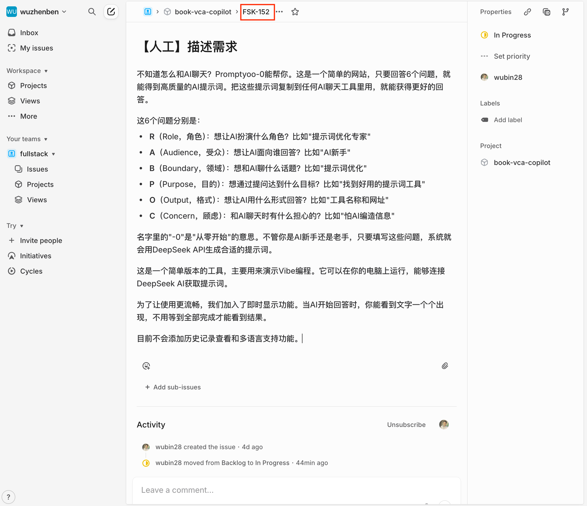

# 第1章 XXXXX

正文段落。（不要不同级别标题之间没有过渡文字。）

## 1.1 XXXXX

正文段落。（不要不同级别标题之间没有过渡文字。）

### 1.1.1 XXXXX

正文段落，如代码清单1-1所示。（下面为带行号代码示例。）

代码清单1-1 XXXXXXXX

```markdown
1.	devstack@devstack:~/devstack$ neutron
1.	//使用不带参数的命令neutron会进入控制台
2.	(neutron) help
3.	Shell commands (type help <topic>):
4.	===================================
5.	...   //所有子命令会列举在这里
6.	(neutron)
```

正文段落，如代码清单1-2所示。（下面为无行号代码示例。）

代码清单1-2XXXXXXXX

```markdown
devstack@devstack:~/devstack$ neutron
//使用不带参数的命令neutron会进入控制台
(neutron) help
Shell commands (type help <topic>):
===================================
...   //所有子命令会列举在这里
(neutron)
```

本段中涉及的主要术语如下。

- FizzBuzz ：一个在面试中测试候选人的程序。 
- 操作系统 ：一款介于计算机的物理硬件和用户之间的中间程序。 
- 图形用户界面（GUI）：用户看屏幕时看到的操作系统的一部分。 

本段中涉及的主要步骤如下。

（1）FizzBuzz ：一个在面试中测试候选人的程序。 

（2）操作系统 ：一款介于计算机的物理硬件和用户之间的中间程序。 

（3）图形用户界面（GUI）：用户看屏幕时看到的操作系统的一部分。 

项目类型如表1-1所示。

表1-1 项目类型

| 项目类型 | 描述 |
| --- | --- |
| 核心（Core） | OpenStack官方项目（绝大多会人会用到的） |
| 孵化（Incubated） | 正在开发的核心项目（即将成为核心项目） |
| 库（Library） | 	核心项目的依赖库 |
| 代码准入（Gating） | 	集成测试套件和部署工具 |


用户和操作系统内核之间的用户界面如图1-1所示。




<aside>
💡

【避坑指南】
图的引用用“见图1-1”“如图1-1所示”。
图只有一个也需要编号，图按章编号，如第1章的图用图1-1，第2章的图用图2-1。
图应放在首次引用的段落之后。

</aside>

#### 1. XXXX

正文段落。

#### 2. XXXX

正文段落。

### 1.1.2 XXXXX

正文段落。

## 1.2 XXXXX

正文段落。（不要不同级别标题之间没有过渡文字。）

### 1.2.1 XXXXX

正文段落。

### 1.2.2 XXXXX

正文段落。

## 1.3 小结

正文段落。